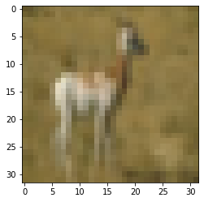
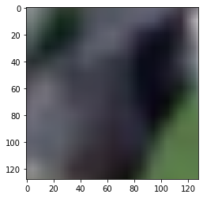
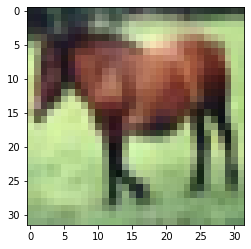
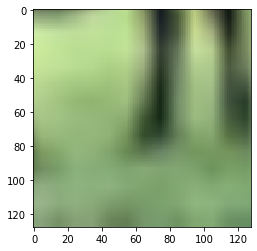

# Albumentations with PyTorch for image data augmentation 

([reference](https://medium.com/mlearning-ai/albumentations-a-python-library-for-advanced-image-augmentation-strategies-752bff3a3da0))


```python
import rsbox
from rsbox import ml_utils
import numpy as np
import pickle

in_file = open('data/mini_cifar.pkl', 'rb')
dset = pickle.load(in_file)
```


```python
img = np.moveaxis(dset[10][0], 0, -1)
img.shape
```


    (32, 32, 3)


**Important**: albumentations only works on (H, W, C) shape images (not (C, H, W)). Your channels have to be at the end. 


```python
ml_utils.plot_np_img(img, True)
```


    

    


```python
img2 = np.moveaxis(dset[11][0], 0, -1)
ml_utils.plot_np_img(img2, True)
```


    

    


## Define some transformations 

Can compose too!


```python
import albumentations as A

my_transform = A.Compose([
    A.Resize(width=320, height=320),
    A.RandomCrop(width=128, height=128),
])
```

Note: must pass in data as named arguments which makes for easy retrieval. ~~What this means is that we can pass in > 1 samples to be transformed at a given time. ~~~ (actual that isn't quite true). 


```python
transformed_img = my_transform(image=img)
transformed_img2 = my_transform(image=img2)
```


```python
t_img = transformed_img['image']
t_img2 = transformed_img2['image']
```


```python
print(t_img.shape)
print(t_img2.shape)
```

    (128, 128, 3)
    (128, 128, 3)


```python
ml_utils.plot_np_img(t_img, True)
ml_utils.plot_np_img(t_img2, True)
```


    

    


    

    


## PyTorch integration 


```python
import torch
from torch.utils.data import Dataset

class SetWithAugmentations(Dataset):
    def __init__(self, data_set, transform=None): 
        self.data_distribution = data_set
        
        # pass on the A.transform as an argument 
        self.transform = transform
    
    def __getitem__(self, index):
        sample = self.data_distribution[index][0]
        sample = np.moveaxis(sample, 0, -1)  # reshape from (C, H, W) to (H, W, C)  
        
        print("Before")
        ml_utils.plot_np_img(sample, True)
        
        # apply the augmentation  
        if self.transform is not None:
            sample = self.transform(image=sample)["image"]
        
        print("After")
        ml_utils.plot_np_img(sample, True)
        
        # reshape back to (C, H, W) 
        sample = np.moveaxis(sample, -1, 0)
                
        label = self.data_distribution[index][1]
        return (torch.tensor(sample, dtype=torch.float), torch.tensor(label)) 
    
    def __len__(self):
        return len(self.data_distribution)
```


```python
torch_set = SetWithAugmentations(dset, transform=my_transform)
```


```python
print(torch_set[0][0].size())
```

    Before


    

    


    After


    

    


    torch.Size([3, 128, 128])


### Code snippet 

Here is the code snippet for the dataset class without visualizations: 


```python
import torch
from torch.utils.data import Dataset

class SetWithAugmentations(Dataset):
    def __init__(self, data_set, transform=None): 
        self.data_distribution = data_set
        
        # pass on the A.transform as an argument 
        self.transform = transform
    
    def __getitem__(self, index):
        sample = self.data_distribution[index][0]
        sample = np.moveaxis(sample, 0, -1)  # reshape from (C, H, W) to (H, W, C)  
        
        # apply the augmentation  
        if self.transform is not None:
            sample = self.transform(image=sample)["image"]
        
        # reshape back to (C, H, W) 
        sample = np.moveaxis(sample, -1, 0)
                
        label = self.data_distribution[index][1]
        return (torch.tensor(sample, dtype=torch.float), torch.tensor(label)) 
    
    def __len__(self):
        return len(self.data_distribution)
```


```python
torch_set = SetWithAugmentations(dset, transform=my_transform)
loader = torch.utils.data.DataLoader(torch_set, batch_size=1)
```


```python
for x, y in loader:
    img = torch.movedim(x[0], 0, -1)
    print("Permuted image")
    ml_utils.plot_np_img(img, True)
    break
```

    Permuted image


    

    


## A note on the definition of augmentation 

At first, I was confused. The length of the dataset: 


```python
print(len(loader))
```

    30


was the same regardless of applying `A.transform`'s or not. But I was wrong. What augmentation does is *not* increase the size of the dataset, but increases the regularization per epoch. Everytime we iterate through one epoch, we still iterate through the same number of samples as originally (here, 30). But we see different versions of the image at each epoch. Thus, mimicing the view that we actually have more data than we really do (hence "augmentation"). This increases generalization. 
